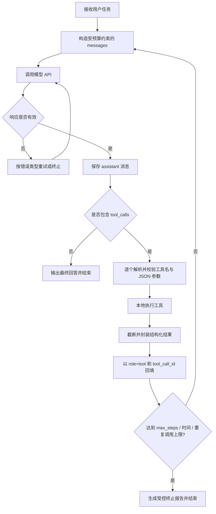

# 轻量级编程智能体技术设计与开发路线图

> 目标：用 Python 3.10+ 独立实现一个无需 Agent 框架、只依赖模型原生 Tool Calling 的本地 Coding Agent。MVP 能在限定工作区内读取和修改文件、运行命令、根据执行结果继续推理，最终完成“定位问题 → 修改代码 → 运行测试 → 汇报结果”的闭环。

## 0. 需求边界与设计结论

### 0.1 必须满足的边界

- 不使用 LangChain、LlamaIndex、OpenAI Agents SDK、AutoGen、CrewAI、Claude Agent SDK 等 Agent 编排框架。
- 不调用服务端 Code Interpreter、Files API、托管 Shell 或托管文件工具。
- `read_file`、`write_file`、`run_command` 均由本地 Python 实现。
- 模型只负责生成文本或原生 `tool_calls`；工具选择后的参数校验、执行、结果回填、历史裁剪、重试与终止均由本项目控制。
- API Key 只从环境变量读取，不写入代码、配置样例、日志、README 或视频。
- 项目应保留真实、连续的 Git 提交历史；截止时间后不再推送。

### 0.2 推荐的最小技术栈

- Python 3.10+
- 厂商原生客户端，或 `openai` Python 客户端连接 OpenAI 兼容端点
- Python 标准库：`subprocess`、`pathlib`、`json`、`hashlib`、`tempfile`、`logging`、`dataclasses`、`time`
- 测试：`pytest`，它不是 Agent 框架，只用于测试
- 可选：厂商 tokenizer；若不引入，则使用保守字符估算并结合 API 返回的 `usage`

建议 MVP 只维护一种内部协议，即 OpenAI 风格的 `messages + tools + tool_calls`。DeepSeek 与阿里云百炼均支持这一调用形态；差异封装在 `providers/` 中，Agent 主循环不感知厂商。

### 0.3 关键设计原则

1. **模型提议，宿主程序裁决。** 模型输出不是可信命令；所有路径、参数、超时和返回值都先经本地校验。
2. **协议状态与展示文本分离。** 内部保留完整的 assistant/tool 消息结构，终端 UI 只展示经过整理的进度。
3. **工具结果结构化。** 每次工具调用均返回 JSON 字符串，至少包含 `ok`、`data`、`error`、`meta`。
4. **默认最小权限。** 文件访问限制在工作区，Shell 使用 `shell=False`，不默认支持管道、重定向或任意 Shell 语法。
5. **可恢复、可解释。** 原子写入、文件哈希、JSONL 轨迹和明确的终止原因，让每一步都能复盘。

### 0.4 桌面 GUI 架构（PySide6）

#### 0.4.1 技术选型

- **框架**：PySide6（Qt for Python），LGPL 许可证
- **选型理由**：
  1. 原生桌面体验，基于系统原生控件，跨平台表现一致且美观
  2. 信号/槽（Signal/Slot）机制天然支持跨线程通信，Agent 运行在后台线程不阻塞界面
  3. 成熟生态与丰富文档，QSS 样式表可深度定制暗色主题
  4. 不引入 Web 技术栈（HTML/CSS/JS），界面代码与 Agent 核心逻辑解耦
  5. 代码增量可控（预计 GUI 层约 500–700 行），符合项目轻量级定位

#### 0.4.2 架构分层

```text
┌─────────────────────────────────────────────────────────────┐
│                    PySide6 GUI Layer                        │
│  ┌─────────────┐  ┌─────────────┐  ┌─────────────────────┐ │
│  │   Menu Bar  │  │  Tool Bar   │  │  Status Bar         │ │
│  └─────────────┘  └─────────────┘  └─────────────────────┘ │
│  ┌─────────────────────────────────────────────────────────┐ │
│  │             QSplitter（双栏可调）                       │ │
│  │  ┌───────────────┐  ┌───────────────────────────────┐ │ │
│  │  │  日志区域     │  │  代码/Diff 区域               │ │ │
│  │  │  (QTextEdit)  │  │  (QTextEdit)                  │ │ │
│  │  │               │  │  + 应用/拒绝按钮              │ │ │
│  │  └───────────────┘  └───────────────────────────────┘ │ │
│  └─────────────────────────────────────────────────────────┘ │
│  ┌─────────────────────────────────────────────────────────┐ │
│  │  底部输入栏 (QLineEdit + QPushButton)                   │ │
│  └─────────────────────────────────────────────────────────┘ │
└─────────────────────────────────────────────────────────────┘
                              │
                              ▼
┌─────────────────────────────────────────────────────────────┐
│              queue.Queue + PySide6 Signal                  │
└─────────────────────────────────────────────────────────────┘
                              │
                              ▼
┌─────────────────────────────────────────────────────────────┐
│              Agent 核心 (agent/loop.py)                    │
│  ┌─────────────┐  ┌─────────────┐  ┌─────────────────────┐ │
│  │  Provider   │  │   Tools     │  │   Context           │ │
│  └─────────────┘  └─────────────┘  └─────────────────────┘ │
└─────────────────────────────────────────────────────────────┘
```

#### 0.4.3 线程模型

| 线程 | 职责 | 通信机制 |
|---|---|---|
| **主线程（GUI 线程）** | 渲染界面、响应用户操作、处理信号/槽 | 接收 `Signal` 更新 UI |
| **工作线程（QThread）** | 运行 Agent 循环（`run_agent`），执行工具调用 | 通过 `Signal` 发射状态更新 |

- 工作线程通过 `PySide6.QtCore.Signal` 将日志、代码内容、Diff 信息发射到主线程
- 主线程通过 `threading.Event` 或 `queue.Queue` 将用户决策（应用/拒绝修改）传回工作线程
- Agent 核心逻辑（`agent/loop.py`）不感知 GUI 存在，仅通过回调函数向外通知

#### 0.4.4 暗色主题配色（Catppuccin Mocha）

| 用途 | 颜色值 |
|---|---|
| 背景（主窗口） | `#1e1e2e` |
| 背景（代码区） | `#11111b` |
| 背景（输入栏/工具栏） | `#181825` |
| 文字（主文本） | `#cdd6f4` |
| 文字（注释/次要） | `#6c7086` |
| 绿色（新增/成功） | `#a6e3a1` |
| 红色（删除/失败） | `#f38ba8` |
| 蓝色（高亮/链接） | `#89b4fa` |
| 紫色（思考/规划） | `#cba6f7` |
| 黄色（警告/修改） | `#f9e2af` |
| 边框/分割线 | `#313244` |
| 悬停/选中 | `#45475a` |

#### 0.4.5 目录结构新增

```text
mini-coding-agent/
├─ gui/
│  ├─ __init__.py          # 导出 MainWindow、AgentWorker
│  ├─ main_window.py       # 主窗口：菜单栏、工具栏、双栏布局、输入栏
│  ├─ theme.py             # QSS 暗色主题样式表
│  └─ worker.py            # QThread 工作线程，运行 Agent 循环
├─ main.py                 # 增加 --gui 启动入口
└─ ...
```

#### 0.4.6 GUI 层扩展接口

1. **文件拖拽**：通过 `QDropEvent` 捕获拖入文件，保存到工作区
2. **快照回退**：工具栏“回退”按钮触发 `rollback_to_snapshot`
3. **交互确认**：Diff 区域“应用修改/拒绝”按钮，通过 `Signal` 传递决策

#### 0.4.7 双模运行能力

- **GUI 模式**：`python main.py --gui` 启动 PySide6 桌面窗口
- **CLI 模式**：`python main.py --cli --workspace ./demo "修复bug"` 保留终端交互
- 两种模式共享同一套 Agent 核心（`agent/`、`tools/`、`providers/`）
- `pytest` 测试套件不受 GUI 代码影响，依然全绿运行

---

## 1. 项目目录结构

```text
mini-coding-agent/
├─ agent/
│  ├─ __init__.py
│  ├─ loop.py                 # Agent 主循环与终止判断
│  ├─ state.py                # AgentState、ToolCall、RunResult 数据结构
│  ├─ context.py              # 历史预算、裁剪、摘要与工作记忆
│  └─ parser.py               # tool_calls/JSON 解析与规范化
├─ providers/
│  ├─ __init__.py
│  ├─ base.py                 # ModelProvider 抽象协议
│  └─ openai_compatible.py    # DeepSeek/百炼共用适配器
├─ tools/
│  ├─ __init__.py
│  ├─ schemas.py              # JSON Schema
│  ├─ registry.py             # 白名单注册、校验、分发与去重
│  ├─ filesystem.py           # read_file/write_file
│  └─ shell.py                # run_command、超时与进程树终止
├─ prompts/
│  └─ system.md               # Agent 行为约束，不承担真正的安全边界
├─ utils/
│  ├─ config.py               # 环境变量与非敏感配置
│  ├─ truncation.py           # 头尾保留、哈希和截断标记
│  └─ logging.py              # 脱敏日志与 JSONL trace
├─ tests/
│  ├─ test_path_guard.py
│  ├─ test_filesystem_tools.py
│  ├─ test_shell_timeout.py
│  ├─ test_parser.py
│  ├─ test_context.py
│  └─ test_agent_loop.py       # 使用 FakeProvider，不消耗真实 API
├─ examples/
│  └─ buggy_calculator/        # 演示用：有失败测试的小项目
├─ traces/                     # 运行时生成，加入 .gitignore
├─ main.py                     # CLI 入口
├─ pyproject.toml
├─ config.example.toml         # 只有非敏感参数
├─ .env.example               # 只有变量名和空值
├─ .gitignore
├─ README.md                  # 仓库完整文档
└─ README.txt                 # 最终提交用，1000 汉字以内
```

模块边界应当清晰：`agent/` 只负责编排；`providers/` 只负责模型协议；`tools/` 只负责本地能力；`utils/` 不包含业务决策。这样面试时可以准确回答“哪一层控制模型、哪一层执行副作用”。

---

## 2. 核心主循环：原生 Tool Calling

### 2.1 流程图



文字版主路径：

> 用户任务 → 模型响应 → 解析工具调用 → 本地执行 → 回填工具结果 → 再次调用模型 → 无工具调用时结束。

### 2.2 状态模型

```python
from dataclasses import dataclass, field
from typing import Any

@dataclass
class ToolCall:
    id: str
    name: str
    arguments_json: str

@dataclass
class AssistantTurn:
    content: str | None
    tool_calls: list[ToolCall]
    protocol_message: dict[str, Any]  # 可直接回填的完整消息

@dataclass
class AgentState:
    messages: list[dict[str, Any]]
    step: int = 0
    started_at: float = 0.0
    repeated_signatures: dict[str, int] = field(default_factory=dict)
    tool_result_cache: dict[str, str] = field(default_factory=dict)
    changed_files: dict[str, str] = field(default_factory=dict)
    last_test_result: str | None = None
```

`protocol_message` 很重要：不要只把 `content` 加回历史。含工具调用的 assistant 消息还需要完整保留 `tool_calls`。如果启用 DeepSeek 思考模式，还应保留响应中的 `reasoning_content`；官方文档指出工具调用后的后续请求必须原样回传该字段，否则可能返回 400。

### 2.3 主循环伪代码

```python
def run_agent(task: str, cfg: Config) -> RunResult:
    state = AgentState(
        messages=[
            {"role": "system", "content": load_system_prompt()},
            {"role": "user", "content": task},
        ],
        started_at=time.monotonic(),
    )

    for step in range(1, cfg.max_steps + 1):
        state.step = step

        if time.monotonic() - state.started_at > cfg.max_wall_seconds:
            return stopped("wall_time_limit", state)

        request_messages = context_manager.fit(
            messages=state.messages,
            tool_schemas=tool_registry.schemas,
            input_budget=cfg.input_token_budget,
        )

        try:
            turn = call_model_with_retry(
                provider=provider,
                messages=request_messages,
                tools=tool_registry.schemas,
            )
        except RetryExhausted as exc:
            return failed("model_api_error", str(exc), state)

        # 必须先保存完整 assistant 消息，再回填对应 tool 结果
        state.messages.append(turn.protocol_message)

        if not turn.tool_calls:
            if turn.content and turn.content.strip():
                return completed(turn.content, state)
            state.messages.append({
                "role": "user",
                "content": "你没有返回文本或工具调用。请继续任务，或明确说明无法继续的原因。",
            })
            continue

        # MVP 顺序执行。并行调用可能同时写同一文件，先不做。
        for call in turn.tool_calls:
            result_json = execute_one_call(call, state, tool_registry, cfg)
            state.messages.append({
                "role": "tool",
                "tool_call_id": call.id,
                "content": result_json,
            })

    return stopped("max_steps", state)
```

### 2.4 五个关键步骤的实现责任

| 步骤 | 本地程序必须做什么 | 不能交给模型做什么 |
|---|---|---|
| 获取响应 | 设置连接/读取超时、有限重试、记录 usage，规范化厂商字段 | 不能让模型决定 API 重试次数或预算 |
| 解析调用 | 检查 `tool_calls` 类型、工具名、JSON、必填字段、参数上限 | 不能 `eval()` 模型文本 |
| 本地执行 | 路径限制、`shell=False`、超时、输出限长、原子写入 | 不能把调用发给服务端托管工具 |
| 结果回填 | 使用匹配的 `tool_call_id`，返回结构化 JSON，保持协议顺序 | 不能只把结果拼成普通 user 文本 |
| 判断终止 | 无工具调用且有最终文本；或命中步数、时间、重复调用等硬上限 | 不能仅依赖模型说“完成了”判断测试是否通过 |

### 2.5 Provider Adapter

```python
class OpenAICompatibleProvider:
    def __init__(self, client, model: str, extra_body: dict | None = None):
        self.client = client
        self.model = model
        self.extra_body = extra_body or {}

    def complete(self, messages: list[dict], tools: list[dict]) -> AssistantTurn:
        response = self.client.chat.completions.create(
            model=self.model,
            messages=messages,
            tools=tools,
            tool_choice="auto",
            temperature=0,
            extra_body=self.extra_body,
        )
        msg = response.choices[0].message
        raw = msg.model_dump(exclude_none=True)
        calls = [
            ToolCall(
                id=item.id,
                name=item.function.name,
                arguments_json=item.function.arguments,
            )
            for item in (msg.tool_calls or [])
        ]
        return AssistantTurn(
            content=msg.content,
            tool_calls=calls,
            protocol_message={"role": "assistant", **raw},
        )
```

配置示例：

```python
from openai import OpenAI
import os

def build_client(provider: str) -> tuple[OpenAI, str, dict]:
    if provider == "deepseek":
        return (
            OpenAI(
                api_key=os.environ["DEEPSEEK_API_KEY"],
                base_url="https://api.deepseek.com",
            ),
            os.getenv("AGENT_MODEL", "请填入当前支持 Tool Calling 的模型名"),
            {},
        )
    if provider == "bailian":
        return (
            OpenAI(
                api_key=os.environ["DASHSCOPE_API_KEY"],
                base_url=os.environ["DASHSCOPE_BASE_URL"],
            ),
            os.getenv("AGENT_MODEL", "qwen-plus"),
            {"enable_thinking": False},
        )
    raise ValueError(f"unsupported provider: {provider}")
```

不要把可能随时间变化的模型名写死为系统核心逻辑。把模型名、地域端点和上下文窗口放入配置，并在启动时打印“provider/model/workspace”，但绝不打印 Key。DeepSeek Tool Calls 与百炼 Function Calling 的官方文档都展示了 `assistant.tool_calls → role=tool + tool_call_id → 再请求` 的闭环：

- [DeepSeek Tool Calls 官方文档](https://api-docs.deepseek.com/guides/tool_calls/)
- [阿里云百炼 Function Calling 官方文档](https://help.aliyun.com/zh/model-studio/qwen-function-calling)

---

## 3. 工具定义与执行细节

### 3.1 Tool Schema

建议 MVP 只提供三个工具，名字短、职责互斥、参数含义明确。

```python
TOOLS = [
    {
        "type": "function",
        "function": {
            "name": "read_file",
            "description": "Read a UTF-8 text file inside the workspace by line range.",
            "parameters": {
                "type": "object",
                "properties": {
                    "path": {"type": "string", "description": "Workspace-relative path"},
                    "start_line": {"type": "integer", "minimum": 1},
                    "max_lines": {"type": "integer", "minimum": 1, "maximum": 500},
                    "max_chars": {"type": "integer", "minimum": 100, "maximum": 50000}
                },
                "required": ["path", "start_line", "max_lines", "max_chars"],
                "additionalProperties": False
            }
        }
    },
    {
        "type": "function",
        "function": {
            "name": "write_file",
            "description": "Atomically replace a UTF-8 text file inside the workspace.",
            "parameters": {
                "type": "object",
                "properties": {
                    "path": {"type": "string"},
                    "content": {"type": "string"},
                    "expected_sha256": {
                        "type": "string",
                        "description": "Hash returned by read_file; empty only when creating a new file"
                    }
                },
                "required": ["path", "content", "expected_sha256"],
                "additionalProperties": False
            }
        }
    },
    {
        "type": "function",
        "function": {
            "name": "run_command",
            "description": "Run one executable with arguments in the workspace. No shell syntax.",
            "parameters": {
                "type": "object",
                "properties": {
                    "argv": {
                        "type": "array",
                        "items": {"type": "string"},
                        "description": "Example: [\"python\", \"-m\", \"pytest\", \"-q\"]"
                    },
                    "cwd": {"type": "string", "description": "Workspace-relative directory"},
                    "timeout_seconds": {"type": "integer", "minimum": 1, "maximum": 120},
                    "max_output_chars": {"type": "integer", "minimum": 1000, "maximum": 50000}
                },
                "required": ["argv", "cwd", "timeout_seconds", "max_output_chars"],
                "additionalProperties": False
            }
        }
    }
]
```

为何 `run_command` 使用 `argv` 而不是一整段命令字符串：`subprocess.Popen(argv, shell=False)` 不经过 Shell 解释器，模型输出的 `|`、`>`、`&&`、变量展开等不会意外变成额外操作。若展示需要管道，可以后续增加独立且需确认的 `run_shell_command`，不要污染安全的默认工具。

### 3.2 参数解析与注册表

```python
TOOL_HANDLERS = {
    "read_file": read_file,
    "write_file": write_file,
    "run_command": run_command,
}

def execute_one_call(call, state, registry, cfg) -> str:
    try:
        args = json.loads(call.arguments_json)
    except json.JSONDecodeError as exc:
        return tool_error("invalid_json", str(exc), retryable=True)

    if not isinstance(args, dict):
        return tool_error("arguments_must_be_object", retryable=True)
    if call.name not in TOOL_HANDLERS:
        return tool_error(
            "unknown_tool",
            details={"allowed": sorted(TOOL_HANDLERS)},
            retryable=True,
        )

    validation_errors = validate_args(call.name, args)
    if validation_errors:
        return tool_error(
            "invalid_arguments",
            details={"errors": validation_errors},
            retryable=True,
        )

    signature = sha256_json({"name": call.name, "args": args})
    state.repeated_signatures[signature] = state.repeated_signatures.get(signature, 0) + 1
    if state.repeated_signatures[signature] >= cfg.max_same_call:
        return tool_error("repeated_call_limit", retryable=False)

    # 同一 tool_call_id 因 API 重试再次出现时，不重复执行有副作用的工具。
    if call.id in state.tool_result_cache:
        return state.tool_result_cache[call.id]

    try:
        result = TOOL_HANDLERS[call.name](**args)
    except Exception as exc:
        result = safe_exception_result(exc)  # 不返回环境变量和完整绝对敏感路径

    encoded = json.dumps(result, ensure_ascii=False)
    state.tool_result_cache[call.id] = encoded
    return encoded
```

`validate_args` 可以手写成每个工具一个校验函数，这更能体现你理解了边界；也可以使用轻量 JSON Schema 校验库，但不要把工具分发和错误策略交给框架。

### 3.3 工作区路径防逃逸

```python
from pathlib import Path

class PathViolation(ValueError):
    pass

def resolve_in_workspace(root: Path, user_path: str) -> Path:
    root = root.resolve(strict=True)
    candidate = (root / user_path).resolve(strict=False)
    try:
        candidate.relative_to(root)
    except ValueError as exc:
        raise PathViolation("path escapes workspace") from exc
    return candidate
```

还应补充以下检查：

- 拒绝绝对路径、空路径和包含 NUL 的路径。
- 读取时要求目标为普通文件；写入时拒绝覆盖目录。
- `cwd` 也必须通过同一函数解析。
- 文件打开前再次检查父目录解析结果，降低符号链接切换带来的风险。
- MVP 可直接拒绝任何解析链中出现的符号链接，简化安全论证。

### 3.4 大文件读取：流式分页，而非一次性读入

```python
def read_file(path: str, start_line: int, max_lines: int, max_chars: int) -> dict:
    target = resolve_readable_file(WORKSPACE, path)
    digest = sha256_file_streaming(target)
    selected: list[str] = []
    char_count = 0
    next_line = None

    with target.open("r", encoding="utf-8", errors="strict") as f:
        for line_no, line in enumerate(f, start=1):
            if line_no < start_line:
                continue
            if len(selected) >= max_lines or char_count + len(line) > max_chars:
                next_line = line_no
                break
            selected.append(f"{line_no:>6} | {line}")
            char_count += len(line)

    return {
        "ok": True,
        "data": "".join(selected),
        "error": None,
        "meta": {
            "path": path,
            "sha256": digest,
            "start_line": start_line,
            "next_line": next_line,
            "truncated": next_line is not None,
        },
    }
```

策略：

- 文本工具只接受 UTF-8；遇到二进制或解码错误时返回明确错误。
- 返回 `next_line`，模型可继续分页读取。
- 限制单次行数和字符数，且在写入上下文前再做一次全局工具输出截断。
- 哈希使用流式分块计算，不把整个文件载入内存。
- 对巨型单行文件，读取循环也必须按 `max_chars` 截断，不能只限制行数。

### 3.5 文件写入：限长、乐观锁、原子替换

```python
import os
import tempfile

def write_file(path: str, content: str, expected_sha256: str) -> dict:
    if len(content.encode("utf-8")) > MAX_WRITE_BYTES:
        return error("content_too_large")

    target = resolve_writable_file(WORKSPACE, path)
    if target.exists():
        actual = sha256_file_streaming(target)
        if actual != expected_sha256:
            return error("file_changed", meta={"actual_sha256": actual})
    elif expected_sha256:
        return error("expected_existing_file")

    target.parent.mkdir(parents=True, exist_ok=True)
    fd, temp_name = tempfile.mkstemp(prefix=".agent-", dir=target.parent)
    try:
        with os.fdopen(fd, "w", encoding="utf-8", newline="") as f:
            f.write(content)
            f.flush()
            os.fsync(f.fileno())
        os.replace(temp_name, target)  # 同一文件系统内原子替换
    finally:
        if os.path.exists(temp_name):
            os.unlink(temp_name)

    return ok(meta={"path": path, "sha256": sha256_file_streaming(target)})
```

MVP 的 `write_file` 是整文件替换，适合小项目。第二阶段可增加 `apply_patch`：要求补丁含上下文行，只在唯一匹配时应用；失败则让模型重新读取。这会显著减少大文件的 token 和误覆盖风险。

### 3.6 Shell 命令：超时与进程树清理

核心原则：

- `shell=False`；`argv[0]` 必须是允许的可执行程序，或至少拒绝明显危险程序。
- `cwd` 必须位于工作区。
- 使用清理后的环境变量，仅继承必要的 `PATH`、编码和虚拟环境信息；不把 API Key 传给子进程。
- 为进程创建独立进程组；超时时终止整棵进程树，而不是只杀父进程。
- 持续排空 stdout/stderr，使用有界的“头部 + 尾部”缓冲，防止海量输出占满内存或造成管道死锁。

示意实现：

```python
def run_command(argv, cwd, timeout_seconds, max_output_chars):
    checked_argv = validate_argv(argv)
    checked_cwd = resolve_directory(WORKSPACE, cwd)
    env = build_sanitized_env()  # 明确删除 DEEPSEEK_API_KEY/DASHSCOPE_API_KEY 等

    popen_kwargs = dict(
        args=checked_argv,
        cwd=checked_cwd,
        env=env,
        shell=False,
        stdin=subprocess.DEVNULL,
        stdout=subprocess.PIPE,
        stderr=subprocess.STDOUT,
        text=True,
        encoding="utf-8",
        errors="replace",
        bufsize=1,
    )
    if os.name == "nt":
        popen_kwargs["creationflags"] = subprocess.CREATE_NEW_PROCESS_GROUP
    else:
        popen_kwargs["start_new_session"] = True

    proc = subprocess.Popen(**popen_kwargs)
    buffer = BoundedHeadTailBuffer(max_output_chars)
    reader = Thread(target=drain_stdout, args=(proc.stdout, buffer), daemon=True)
    reader.start()

    timed_out = False
    try:
        exit_code = proc.wait(timeout=timeout_seconds)
    except subprocess.TimeoutExpired:
        timed_out = True
        kill_process_tree(proc)
        exit_code = proc.wait(timeout=5)
    finally:
        reader.join(timeout=2)

    return {
        "ok": exit_code == 0 and not timed_out,
        "data": buffer.render(),
        "error": "timeout" if timed_out else (None if exit_code == 0 else "nonzero_exit"),
        "meta": {
            "exit_code": exit_code,
            "timed_out": timed_out,
            "duration_ms": elapsed_ms(),
            "output_truncated": buffer.truncated,
        },
    }
```

进程树终止：

- POSIX：新会话启动后调用 `os.killpg(proc.pid, signal.SIGTERM)`，短暂等待后再 `SIGKILL`。
- Windows：使用 `taskkill /PID <pid> /T /F` 终止子树；调用仍应是参数数组且 `shell=False`。
- 超时是工具结果，不是整个 Agent 崩溃。模型收到 `timed_out=true` 后可选择缩小测试范围或换命令。

输出截断建议保留开头和结尾，因为报错原因常在结尾：

> result = first 12,000 chars + “省略 N chars，完整输出 SHA-256=...” + last 12,000 chars

### 3.7 建议的命令安全分级

| 级别 | 示例 | 行为 |
|---|---|---|
| 只读/验证 | `python -m pytest -q`、`git diff`、`python -m compileall` | 自动执行 |
| 工作区内修改 | 格式化器、代码生成器 | MVP 可执行，但记录修改前后 Git diff |
| 网络/安装 | `pip install`、`git clone` | 默认拒绝或要求用户确认 |
| 高风险 | 删除、磁盘管理、权限修改、系统关机 | 始终拒绝 |

仅靠命令黑名单并不完备。项目答辩时应坦诚：真正强隔离需要容器、低权限账户或 OS sandbox；MVP 实现的是工作区约束、无 Shell 解释、环境脱敏和显式策略，不声称达到恶意代码安全执行级别。

---

## 4. 上下文与 Token 管理策略

### 4.1 预算公式

不要把上下文窗口全部交给输入。配置以下量：

> 可用输入预算 = 模型上下文上限 − 预留输出 Token − 安全余量 − Tool Schema 估算

示例仅用于说明：若上下文上限为 64k，可预留 8k 输出、2k 安全余量，再扣除工具描述。实际数值应从当前模型配置读取，不应硬编码为厂商永远不变的规格。

### 4.2 三层记忆

1. **完整轨迹层：** 所有请求、响应、工具调用、耗时和截断元数据写入本地 JSONL，只用于审计，不全部回传模型。
2. **活跃上下文层：** system prompt、当前任务、最近若干完整交互单元、最新测试结果。
3. **工作记忆层：** 旧历史被压缩成事实清单，例如已读文件、修改文件及哈希、失败原因、未完成事项。

工作记忆示例：

```json
{
  "goal": "修复 divide 对零输入的行为并通过测试",
  "facts": ["失败测试是 tests/test_calc.py::test_divide_zero"],
  "changed_files": {"src/calc.py": "sha256:..."},
  "commands": [{"argv": ["python", "-m", "pytest", "-q"], "exit_code": 1}],
  "open_items": ["修改后尚未重跑完整测试"]
}
```

### 4.3 手动裁剪算法

```python
def fit_context(messages, tool_schemas, input_budget):
    system = messages[0]
    units = group_protocol_units(messages[1:])
    # 一个 assistant(tool_calls) 和其所有 tool 结果必须视为不可拆分单元。

    selected = []
    for unit in reversed(units):
        # 从最新单元向前选择，因此当前用户任务自然包含在最先选择的单元中。
        recent = list(reversed(selected + [unit]))
        candidate = [system, build_work_memory(units, recent), *recent]
        if estimate_tokens(candidate, tool_schemas) > input_budget:
            break
        selected.append(unit)

    compacted = compact_old_units(units_not_selected=...)
    result = [system, compacted, *reversed(selected)]
    # 若最新用户任务本身过长，先按明确规则截断附件/代码块，但保留任务目标。
    result = ensure_latest_user_goal_present(result, messages)
    assert_protocol_valid(result)
    return result
```

裁剪优先级：

1. 先截断很长的旧工具输出，保留命令、退出码、首尾错误和哈希。
2. 再删除已被后续读取覆盖的旧文件片段。
3. 再把旧交互确定性压缩为工作记忆。
4. 最后才丢弃最旧单元。
5. 永远保留 system prompt、当前用户目标、最近修改文件列表和最新测试结论。

### 4.4 Token 估算

- 最佳方案：对接所选模型公开 tokenizer。
- MVP 方案：按字符和 UTF-8 字节数做保守估算，并加 20% 至 30% 余量。
- 每次 API 返回后记录真实 `prompt_tokens/completion_tokens`；若估算持续偏低，动态提高系数。
- Tool Schema 也占输入 Token，必须计入。
- 捕获厂商的 context-length 错误后，立即提高裁剪强度并只重试一次，避免死循环。

### 4.5 为什么不应只让模型“总结全部历史”

模型摘要可能丢失精确路径、测试名、退出码或错误细节。推荐先做确定性压缩，再将可选的模型摘要标记为“非权威说明”；文件哈希、命令结果和修改清单仍由程序生成。

---

## 5. 健壮性与错误处理

### 5.1 错误分类与动作

| 错误 | 处理方式 | 是否重试 |
|---|---|---|
| 连接超时、429、部分 5xx | 指数退避 + 随机抖动，记录 attempt | 最多 3 次 |
| 401/403、无效模型名 | 立即停止，提示配置问题 | 否 |
| 上下文过长 | 加强裁剪后重试 | 1 次 |
| `arguments` 非法 JSON | 以结构化 tool error 回填，让模型改参 | 是，计入 step |
| 未知工具或多余字段 | 返回允许列表和校验错误 | 是，计入 step |
| 路径越界 | 拒绝执行并回填 `path_violation` | 不对同参重复执行 |
| 文件哈希冲突 | 要求重新读取后再写 | 是 |
| 命令非零退出 | 将退出码与截断输出回填 | 由模型决定下一步 |
| 命令超时 | 终止进程树并回填 timeout | 由模型缩小范围 |
| 空响应 | 添加一次纠错消息 | 最多 1 至 2 次 |
| 达到 `max_steps` | 停止工具执行，返回未完成报告 | 否 |

### 5.2 模型调用重试

```python
def call_model_with_retry(provider, messages, tools, max_attempts=3):
    for attempt in range(1, max_attempts + 1):
        try:
            return provider.complete(messages, tools)
        except (RateLimitError, APITimeoutError, APIConnectionError, Retriable5xx) as exc:
            if attempt == max_attempts:
                raise RetryExhausted from exc
            delay = min(8.0, 0.5 * (2 ** (attempt - 1))) + random.uniform(0, 0.25)
            time.sleep(delay)
        except (AuthenticationError, PermissionDeniedError, BadRequestError):
            raise
```

API 重试必须复用同一份请求状态。工具执行重试则要更谨慎：通过 `tool_call_id` 缓存结果，避免一次写文件因网络故障被执行两次。

### 5.3 循环终止条件

同时设置以下硬限制：

- `max_steps`：默认 200；GUI 达到上限后可由用户反复批准，每次把累计上限增加 50。
- `max_duration_seconds`：默认 20 分钟；即使用户继续增加步数，该硬时限仍然有效。
- `max_same_call`：完全相同的工具名与参数最多 3 次。
- `max_tool_calls_total`：例如 40 次。
- `max_consecutive_errors`：例如连续 5 次工具错误。
- 用户中断：捕获 Ctrl+C，保存 trace 并返回 `cancelled`。

正常完成条件不应只是“模型说完成”。程序可以记录可验证状态：最近一次测试命令是否退出 0、修改文件是否存在、是否仍有未处理工具调用。最终结果建议包含：

```json
{
  "status": "completed | stopped | failed | cancelled",
  "reason": "final_answer | max_steps | model_api_error | user_cancelled",
  "answer": "...",
  "steps": 7,
  "changed_files": ["src/calc.py"],
  "last_test_exit_code": 0,
  "trace_path": "traces/run-...jsonl"
}
```

### 5.4 对模型格式错误的两级策略

1. **原生 Tool Calling 路径：** 优先读取 SDK 返回的 `message.tool_calls`，不从普通文本猜 JSON。
2. **兼容降级路径：** 只有明确选择“不支持原生 Tool Calling 的模型”时，才允许约定 `<tool_call>{...}</tool_call>`；解析必须定位标记、`json.loads`、Schema 校验，绝不能 `eval`。此降级路径不要作为演示主线。

DeepSeek 当前还提供严格 Schema 模式，但它是服务端格式保证的增强项，不应替代本地参数和权限校验。即使参数 JSON 合法，路径仍可能越界，命令仍可能危险。

### 5.5 日志与脱敏

每个 JSONL 事件包含：`run_id`、时间、step、事件类型、工具名、参数摘要、耗时、退出码、截断信息和 usage。以下内容必须脱敏：

- API Key、Authorization header、Cookie。
- 子进程环境变量。
- 超出工作区的绝对路径。
- 可能由命令输出打印的密钥模式，如 `sk-...`。

日志展示可以有两档：默认终端只显示摘要；`--verbose` 展示工具参数和截断结果，但仍执行脱敏。

### 5.6 必做测试

```text
单元测试
├─ ../secret.txt、绝对路径、符号链接逃逸均被拒绝
├─ read_file 分页与巨型单行截断正确
├─ write_file 哈希冲突不覆盖，成功写入是原子的
├─ run_command 正常退出、非零退出、超时、海量输出均可回收
├─ 非法 JSON、未知工具、多余字段不会触发真实执行
├─ assistant/tool 消息配对在裁剪后仍合法
└─ 同一 tool_call_id 不会重复产生副作用

集成测试（FakeProvider）
├─ read → write → test → final 的完整闭环
├─ 首次参数错误后模型修正
├─ API 暂时失败后重试成功
├─ 重复调用触发停止
└─ max_steps 触发可读的未完成报告
```

FakeProvider 预先返回固定的 `AssistantTurn` 序列。这样可以在没有 API Key、没有费用、没有网络的情况下稳定测试主循环，这也是很适合答辩展示的工程亮点。

---

## 6. 提交物建议

### 6.1 README 应突出什么

仓库 `README.md` 可以详细；最终压缩包中的 `README.txt` 必须控制在 1000 汉字以内。推荐结构：

1. 仓库地址。
2. 一句话定位：零 Agent 框架、本地工具、自主循环。
3. 环境与三步运行命令。
4. 三个核心亮点。
5. 安全边界与限制。
6. 演示任务说明。

最值得突出的亮点：

- **自主编排：** 自写 Tool Calling 循环、消息协议、终止与重试。
- **安全本地工具：** 工作区路径防逃逸、原子写入、`shell=False`、超时杀进程树、输出有界截断。
- **可验证与可复现：** FakeProvider 测试、JSONL trace、文件哈希和测试退出码。
- **多模型适配：** 同一内部接口切换 DeepSeek/百炼，Agent 核心不依赖厂商。
- **上下文工程：** 工具调用单元不拆分、确定性工作记忆、真实 usage 校准。

不要写“完全安全”“支持任意命令”“100% 自主解决所有任务”等无法辩护的表述。应明确它是受限工作区内的轻量级原型。

### 6.2 README.txt 草案骨架

```text
项目名称：Mini Coding Agent
仓库地址：<公开仓库 URL>

本项目使用 Python 3.10+ 独立实现轻量级编程智能体，不依赖任何 Agent 框架。模型通过原生 Tool Calling 提议操作，本地程序负责对话历史、JSON 参数校验、工具执行、结果回填、重试与终止。

运行：
1. 安装依赖：python -m pip install -e .
2. 设置 DEEPSEEK_API_KEY 或 DASHSCOPE_API_KEY 等环境变量
3. 执行：python main.py --workspace examples/buggy_calculator "修复除零错误并运行测试"

特色：工作区路径隔离；文件哈希与原子写入；Shell 超时和进程树清理；长输出头尾截断；上下文预算与 JSONL 运行轨迹；可切换 DeepSeek/百炼。

限制：默认不执行网络安装或高风险系统命令，仅面向受控本地代码工作区。
```

最终提交前按“汉字/字符”口径自行统计，保留余量，不要恰好卡在 1000。

### 6.3 两分钟演示的最佳场景

最佳场景是：**修复一个已有失败测试的真实小 Bug，并再次运行测试。**

推荐 `buggy_calculator` 示例：`divide(a, b)` 对 `b=0` 的行为不符合测试期望。Agent 应完成：

1. 读取失败测试和实现文件。
2. 首次运行测试，看到真实失败。
3. 修改最小代码。
4. 再次运行测试并通过。
5. 最终汇报修改文件、原因和测试结果。

时间脚本：

| 时间 | 画面/讲解 |
|---|---|
| 0:00–0:15 | 一句话目标与硬约束：无 Agent 框架、本地工具 |
| 0:15–0:35 | 展示目录和主循环核心，不逐行念代码 |
| 0:35–1:30 | 输入任务；加速展示 read/run/write/run 的工具轨迹 |
| 1:30–1:48 | 展示测试从失败到通过，以及 Git diff |
| 1:48–2:00 | 总结安全边界、上下文管理和多模型适配 |

视频中隐藏终端环境变量；录制前清屏，并检查 Shell 历史、配置文件、日志与画面角落是否出现 Key。演示任务应提前固化在仓库中，但模型运行轨迹要真实，不要只播放预录文本。

---

## 7. 开发路线图（按 2026-09-02 截止倒排）

### 8 月 27 日：最小闭环

- 建仓库与 `pyproject.toml`，配置 `.gitignore` 和环境变量。
- 实现 `ModelProvider`、三个 Tool Schema、最小主循环。
- 用 FakeProvider 跑通 `read → write → run → final`。
- 提交：`feat: bootstrap native tool-calling loop`。

验收：没有真实 API 也能通过一条集成测试；代码中搜索不到真实 Key。

### 8 月 28 日：本地工具可靠性

- 完成路径防逃逸、UTF-8 分页读取、哈希、原子写入。
- 完成 Shell 超时、进程树终止和有界输出。
- 补齐异常路径测试。
- 提交：`feat: harden local filesystem and command tools`。

验收：路径逃逸、哈希冲突、超时、海量输出测试全部通过。

### 8 月 29 日：模型接入与上下文

- 接入首选厂商，跑通真实 Tool Calling。
- 再接入第二厂商，验证切换只改配置。
- 实现历史分组、工具输出压缩、工作记忆与 usage 日志。
- 提交：`feat: add provider adapters and context budgeting`。

验收：同一演示任务可在至少一个真实模型上稳定完成；换厂商不改主循环。

### 8 月 30 日：健壮性与可观测性

- 实现 API 分类重试、空响应纠错、重复调用检测和各类终止报告。
- 实现脱敏 JSONL trace 和 Ctrl+C 保存。
- 建立 `examples/buggy_calculator` 演示项目。
- 提交：`test: cover retries limits and end-to-end repair`。

验收：`pytest -q` 全绿；断网、错误 Key、错误工具参数均不会导致未捕获崩溃。

### 8 月 31 日：文档与答辩准备

- 完成仓库 `README.md`、架构图、运行示例和限制声明。
- 起草 1000 汉字以内 `README.txt`。
- 准备答辩问题：为什么不用框架、为什么 `shell=False`、如何保证协议合法、为何需要哈希与原子写入。
- 提交：`docs: explain architecture safety boundaries and demo`。

### 9 月 1 日：冻结与录制

- 在干净环境按 README 从零安装并复现。
- 固定依赖版本，检查公开仓库与完整提交历史。
- 录制不超过 2 分钟、200 MB 的 mp4；检查无 Key 泄漏。
- 只修阻断性问题，不再增加大功能。

### 9 月 2 日：提交缓冲

- 上午完成最终 smoke test 和文档字符数检查。
- 用姓名命名 zip，仅放 `README.txt` 与视频。
- 提前上传并核验，以最后一次提交为准。
- 北京时间 24:00 后不再向仓库推送。

### 功能优先级

```text
P0 必须完成
  原生 Tool Calling 主循环
  read_file / write_file / run_command
  路径限制、超时、输出截断
  max_steps、API 错误处理
  一条真实“修改并测试”演示

P1 强烈建议
  原子写入与 expected_sha256
  FakeProvider 集成测试
  JSONL trace 与脱敏
  上下文工作记忆

P2 有余力再做
  apply_patch
  流式 UI
  用户确认机制
  多 Provider 切换
```

如果时间紧，宁可把 P0/P1 做扎实并能解释，也不要加入搜索、MCP、多智能体、向量数据库、GUI 等偏离题目核心的功能。

---

## 8. 面试时应能讲清的设计决策

1. **为什么 Agent 会“继续工作”？** 因为宿主程序发现 `tool_calls` 后执行并回填，再次调用模型；循环由代码控制，不是 SDK 自动完成。
2. **为什么工具结果用 `role=tool`？** 它与 assistant 产生的 `tool_call_id` 建立协议级对应，模型能区分观察结果与用户新指令。
3. **为什么不直接 `shell=True`？** 因为 Shell 会解释管道、重定向和变量展开，扩大模型文本的执行能力；参数数组更容易校验。
4. **为什么写文件需要哈希？** 防止模型根据旧内容覆盖用户或其他进程刚做的修改。
5. **为什么裁剪不能拆开 tool call？** assistant 的调用与 tool 结果是协议原子单元，拆开会导致上下文无效或语义缺失。
6. **如何证明不是套壳？** 展示 `loop.py`、`registry.py`、`shell.py`、`context.py` 和 FakeProvider 测试；模型客户端只完成一次普通 Chat Completion 请求。
7. **当前安全边界是什么？** 面向可信用户和受控项目代码；它降低误操作风险，但不等价于容器级恶意代码隔离。

这套边界清晰、闭环完整、可测试、可解释，最符合“独立实现轻量 Coding Agent”项目对工程理解的考察重点。
